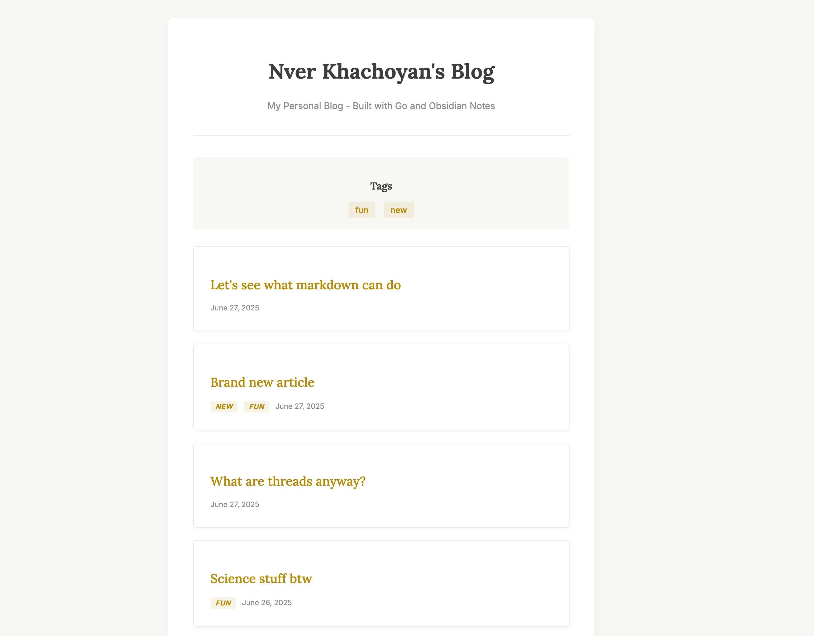

# Gobsidian

The simplest static site generator for Obsidian notes written in Go.

### Run with this command

```bash
go run ./cmd
```

### Flags

`--clear` removes the public directory before generating the site.

`--watch` will watch for changes in the `public` and `templates` directories.

`--serve` serve the generated website after building

`--port` port to serve the website on

### Config

`config.yaml` is the config file.

```yaml
InputDirectory: ./posts
OutputDirectory: ./public
SiteTitle: Nver Khachoyan's Blog
SiteSubtitle: Random ramblings
BaseURL: /
```

`InputDirectory` is the obsidian vault directory.

### Current state

1. [x] Backlinks
2. [_] Backlink embeds
3. [x] Obsidian style images
4. [x] Frontmatter parsing (yaml)
5. [x] Folders and Subfolders

### Frontmatter

Supported frontmatter fields are `title`, `date`, `author`, and `updatedAt`.

You can demo it at [blog.nverk.me](https://blog.nverk.me/).


