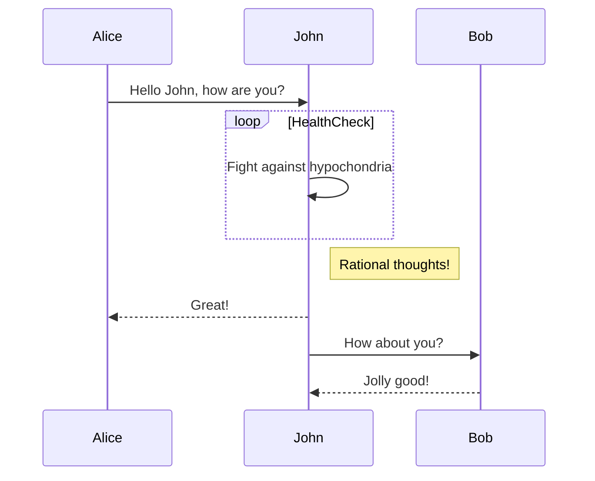

[X] Fix the issue where a link to a post inside nested folders doesn't resolve to the post if the link only contains the name like so

[[Personal/Tomfoolery And Stuff/What are threads anyway?]]


10:57PM Cooking 🍪: Site generation complete! duration=22.472125ms posts=10 tags=2 index_pages=1 preview_pages=10 folders=3


11:22PM Cooking 🍪: Wikilink parsing took 232.914833ms
11:22PM Cooking 🍪: Transformation took 225.246417ms
11:22PM Cooking 🍪: Directory creation took 31.738458ms
11:22PM Cooking 🍪: Graph generation took 307.362125ms

$$ \frac{a}{b} $$

$$\int_0^1 x^2 dx$$ 




```html
{{if .Tags}}

<div class="left-sidebar-item">

<h5 class="left-sidebar-item-title">Tags</h5>

<div class="left-sidebar-item-content">

<nav class="tags-nav">

<ul>

{{range .Tags}}

<li><a href="/tag/{{.Slug}}/">#{{.Name}}</a></li>

{{end}}

</ul>

</nav>

</div>

</div>

{{end}}
```


>[!info]
>This info callout is great. It is informative as heck!

  

>[!warning]
>This warning callout is warning you about the monster under your bed!

  

>[!success]
>Great success!
>
>**Lorem Ipsum** is simply dummy text of the printing and typesetting industry. Lorem Ipsum has been the industry's standard dummy text ever since the 1500s, when an unknown printer took a galley of type and scrambled it to make a type specimen book.

