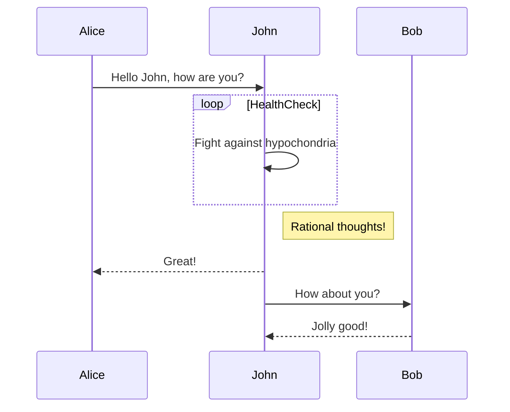

## LaTex


$$\int_0^1 x^2 dx$$ 
## Mermaid Diagrams




## Code blocks

```go
package main

import "fmt"

func main() {
    fmt.Println("Hello, Go!")
    var henlo string
}
```


## Callouts

>[!info]
>This info callout is great. It is informative as heck!

  

>[!warning]
>This warning callout is warning you about the monster under your bed!

  

>[!success]
>Great success!
>
>**Lorem Ipsum** is simply dummy text of the printing and typesetting industry. Lorem Ipsum has been the industry's standard dummy text ever since the 1500s, when an unknown printer took a galley of type and scrambled it to make a type specimen book.


# Other markdown niceties 

## Blockquotes

> Markdown is a lightweight markup language with plain-text-formatting syntax, created in 2004 by John Gruber with Aaron Swartz.
> 
> > Markdown is often used to format readme files, for writing messages in online discussion forums, and to create rich text using a plain text editor.

## Tables

| Left columns | Right columns |
| ------------ | ------------- |
| left foo     | right foo     |
| left bar     | right bar     |
| left baz     | right baz     |

And more...


![[Excalidraw/Drawing 2025-07-18 02.38.02.excalidraw.md#^group=yWgKIOhR]]


![[Drawing 2025-07-18 02.38.02.excalidraw]]